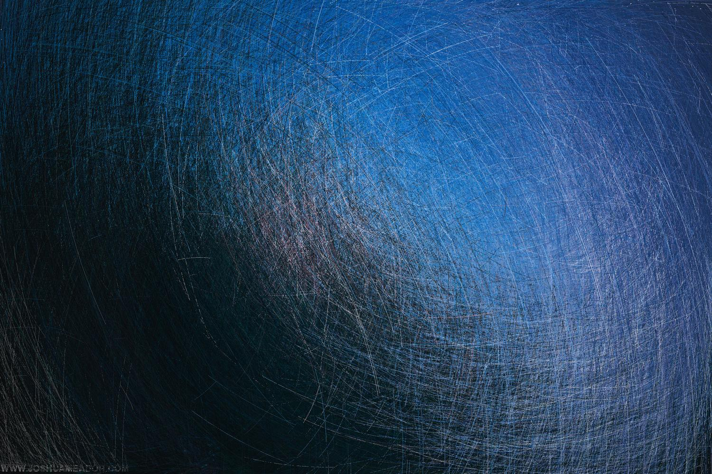

.. image:: https://travis-ci.org/willpatterson/ImageFudge.svg?branch=master
    :target: https://travis-ci.org/willpatterson/ImageFudge

******************
Image Fudge README
******************

Image Fudge is a mob-programmed image glitching library being developed by `willpatterson <https://www.github.com/willpatterson>`_, `konstantinfarrell <https://www.github.com/konstantinfarrell>`_ and `seansisson <https://www.github.com/seansisson>`_.

**Image Fudge is pre-release software**

Examples from initial testing:
------------------------------

Install
-------

:code:`make init`

:code:`source .env/bin/activate`

Run
---

:code:`make`

Troubleshooting
---------------

If there are issues installing pillow and you get an error like

::

    Error Message: ValueError: jpeg is required unless explicitly disabled using --disable-jpeg, aborting

Make sure you have the following packages: (CentOS)

::

    gcc python-devel libjpeg-devel zlib-devel
