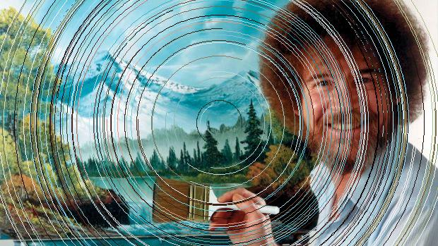

******************
Image Fudge README
******************

Image Fudge is a mob-programmed image glitching library being developed by `willpatterson <https://www.github.com/willpatterson>`_, `konstantinfarrell <https://www.github.com/konstantinfarrell>`_ and `seansisson <https://www.github.com/seansisson>`_.

**Image Fudge is pre-release software**

Example:

**Before:**

**After:**

Install
-------

:code:`make init`

:code:`source .env/bin/activate`

Run
---

:code:`make`
